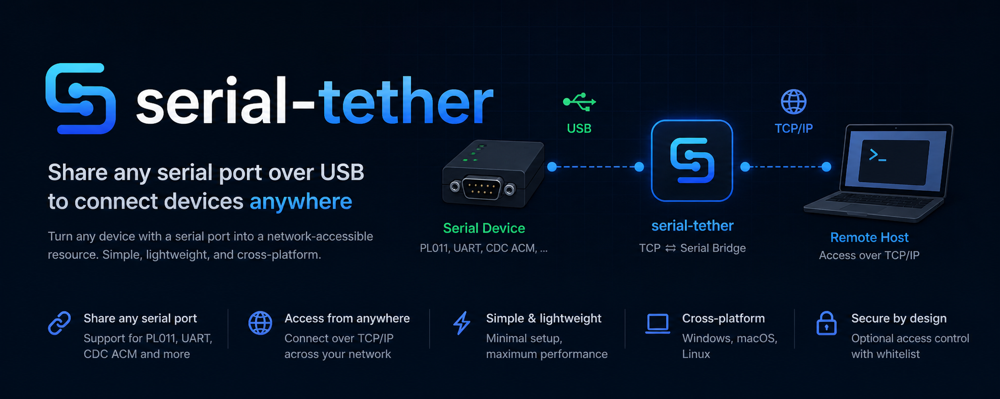

# Serial Tether



> A daemon and CLI that lets AI agents and humans share a single serial device.

**Docs**:
- [`docs/OVERVIEW.md`](docs/OVERVIEW.md) — what it is, why, and how it works (read this first)
- [`docs/AGENT_USAGE.md`](docs/AGENT_USAGE.md) — one-page command cookbook for AI agents
- [`docs/PROTOCOL.md`](docs/PROTOCOL.md) — JSON-RPC 2.0 / NDJSON wire spec (v1)
- [`examples/`](examples/) — five working Bash automation scripts

`tetherd` owns the serial port; multiple clients (`tether`, user scripts, the future `tether-tui`) connect over a Unix socket / Named Pipe / TCP and read and write concurrently. The agent-facing CLI (`tether`) is transactional, structured, and bounded by design: JSON-RPC responses carry decoded text, exit codes follow shell conventions, the `run` primitive is race-free at the daemon level, and output truncation guards LLM context budgets.

## Why

Embedded development is a lot of staring at a serial console — kicking a
bootloader, reading kernel logs, exercising firmware against a corner case.
Increasingly an AI coding agent wants to do that staring too: react to a
stack trace, set a U-Boot env var, drive a board through a regression suite,
read sensor output, retry after a flash. The naïve loop — "agent describes
a command in chat → human copies it into `tio` → human pastes the output
back" — is slow, brittle, and pointless.

Serial Tether's job is to hand that loop directly to the agent **without
elbowing the human out**. The daemon takes ownership of `/dev/ttyUSB0`
once. From there, three audiences share the same port at the same time:

- **AI agents** drive the board through a JSON-RPC CLI that is transactional,
  structured, and bounded by design. Race-free `run`, ANSI-stripped and
  echo-stripped `output`, standard exit codes, configurable length
  truncation so the LLM context never blows up — the things that turn flaky
  scripted automation into reliable scripted automation.
- **Humans** stay in full control on the same port: drop into a `tio`-style
  raw-mode interactive shell with `tether`, tail every byte the agent is
  sending and receiving with `tether tail`, override or interrupt at will.
  No "agent mode" that locks the operator out — quite the opposite, the
  human gets a god's-eye view of what every other client is doing.
- **CI and shell scripts** ride the same wire. `if tether run … ; then …;
  case $? in 124) … esac` is just a few lines, and it works the same way
  whether the daemon is on this machine, behind SSH, or on a VM across the
  room.

The whole thing is meant to be agnostic about *what* sits on the other end
of the serial link — U-Boot, Linux console, busybox login, vendor monitors,
RTOS REPLs, raw MCU debug streams — because the daemon just shuttles bytes
and surfaces them with race-free framing. Intelligence about prompts,
escape sequences, and command grammars belongs in the client (or the agent
driving it), where it's easy to evolve.

In one line: **modern, AI-friendly, multi-tenant access to the serial port
across the whole spectrum of embedded development, without taking the port
away from the engineers who have always lived inside it.**

## Components

The `serial-tether` package ships two binaries:

- **`tetherd`** — daemon. Owns the serial port; fans a single ring buffer out to every attached session.
- **`tether`** — non-interactive CLI. `send` / `expect` / `run` / `status` / `tail` / `sync`.

Plus a supporting library:

- **`tether-protocol`** — wire-protocol types and NDJSON codec (shared between daemon and client).
- **`tether-tui`** *(planned)* — interactive TUI client for human use.

## Install (macOS / Linux)

Every option below installs both `tetherd` and `tether`. Pick the one you prefer.

**Homebrew** (recommended on macOS — no Rust toolchain needed):
```sh
brew install hulryung/tether/serial-tether
```

**`cargo install`** (with a Rust toolchain — works on any platform Rust supports):
```sh
cargo install serial-tether
```

**Pre-built binaries via curl** (no dependencies):
```sh
curl --proto '=https' --tlsv1.2 -LsSf https://github.com/hulryung/serial-tether/releases/download/v0.5.0/serial-tether-installer.sh | sh
```

Or **build from source**:
```sh
git clone https://github.com/hulryung/serial-tether
cd serial-tether
cargo build --workspace --release
# binaries land in ./target/release/{tetherd,tether}
```

## Quick start

```sh
# Terminal 1 — daemon owns the port (default: UDS at /tmp/tetherd.sock)
tetherd -D /dev/tty.usbserial-XXXX -b 115200

# Terminal 2 — drop into a tio-style interactive shell
tether                                  # Ctrl-A then Q to quit

# Or, for agents / scripts:
tether status
tether run "version" -u "# " --literal --timeout-ms 3000 --json
tether tail
```

If the daemon isn't running, `tether` prints exactly how to start it.

### Remote daemon (TCP)

To drive a board attached to one host from another machine, start the daemon
with TCP listening:

```sh
# On the daemon host:
tetherd -D /dev/tty.usbserial-XXXX -b 115200 --tcp
# Banner prints the auto-generated token and every reachable IP. Pin the
# token explicitly with --auth-token MYSECRET if you want it stable across
# restarts. Use --tcp 127.0.0.1:5557 for loopback only.

# On the agent host:
TETHER_AUTH_TOKEN=MYSECRET tether -s tcp://daemon-host:5557 status
TETHER_AUTH_TOKEN=MYSECRET tether -s tcp://daemon-host:5557 run "version" \
    --newline crlf -u "# " --literal --timeout-ms 3000 --json
```

UDS connections are authenticated by the OS (file permissions); TCP
connections always require a token. Run with both `-s /tmp/tetherd.sock` and
`--tcp ...` to expose the daemon on both transports simultaneously.

## The one command an agent should reach for

```sh
tether --json run "$cmd" -u "$prompt" --literal --timeout-ms 5000
# → { matched, match, output (decoded text), truncated, duration_ms, ... }
# → exit 0 (ok) / 124 (timeout) / 2 (protocol) / 3 (connect) / 4 (device) / 5 (overflow) / 6 (lock) / 7 (unauthorized)
```

Agent-friendly defaults are baked in: `--strip-ansi`, `--strip-echo`, `--max-output-bytes 8192`. The `--json` payload includes a decoded `output` field so an LLM never has to deal with base64.

## Protocol

[`docs/PROTOCOL.md`](docs/PROTOCOL.md) — JSON-RPC 2.0 over NDJSON. The same wire format works on UDS, Named Pipe, or TCP.

## Verifying the build

A virtual serial pair smoke test (no `socat` required, only Python 3 and the built binaries):

```sh
bash tools/smoke_test.sh
```

## Status

Shipped through v0.5.0:
- ✅ `hello` / `attach` / `detach` / `send` / `expect` / `run` / `status`
- ✅ writer lock with `preempt` policy (queue / fail / force)
- ✅ `strip_ansi` / `strip_echo` / `max_output_bytes` (with truncation marker)
- ✅ standard exit codes; decoded `output` field in `--json`
- ✅ `sync` (send CR, wait until idle, surface a prompt candidate)
- ✅ ring-buffer fan-out with separate consumer / notify cursors per session
- ✅ TCP transport with token auth (`--tcp [HOST:PORT] --auth-token …`)
- ✅ Single daemon can listen on UDS and TCP simultaneously
- ✅ Startup banner enumerating reachable IPs and the auth token
- ✅ `tether shell` — interactive raw-mode client (Ctrl-A then Q to quit)
- ✅ `tether` (no subcommand) drops into the shell
- ✅ Friendly error when the daemon isn't running (with the command to start one)

Not yet:
- Windows Named Pipe backend
- 30-second session resume after disconnect
- `cancel` method
- TLS for TCP (use SSH/WireGuard for untrusted networks for now)

## License

Licensed under either of

- Apache License, Version 2.0 ([LICENSE-APACHE](LICENSE-APACHE) or <http://www.apache.org/licenses/LICENSE-2.0>)
- MIT license ([LICENSE-MIT](LICENSE-MIT) or <https://opensource.org/license/mit>)

at your option.

### Contribution

Unless you explicitly state otherwise, any contribution intentionally submitted
for inclusion in the work by you, as defined in the Apache-2.0 license, shall
be dual licensed as above, without any additional terms or conditions.
